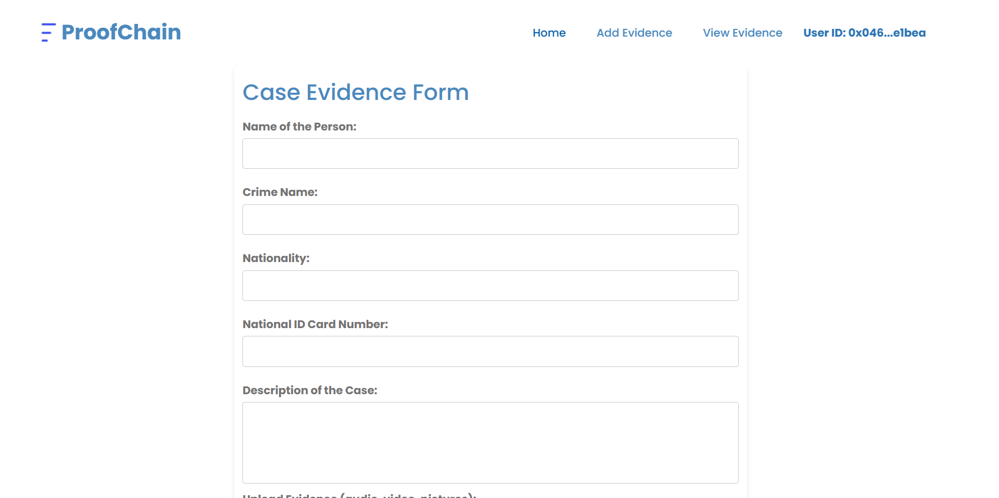
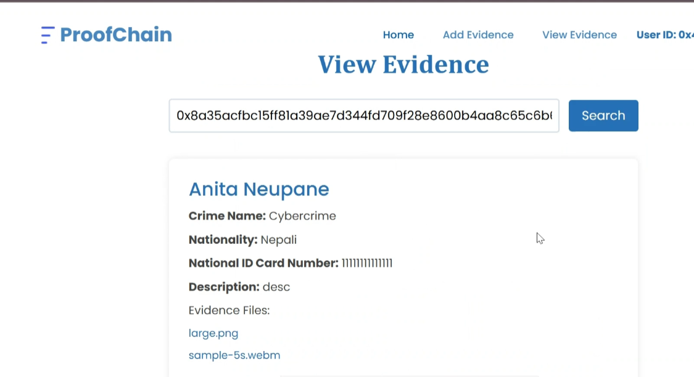

# ProofChain


## Project Description
ProofChain is a decentralized, web-based Evidence Management System (EMS) designed to securely store and retrieve criminal data. It leverages blockchain technology, IPFS (InterPlanetary File System), and MetaMask to ensure the immutability and security of evidence. 
## Features
* **User Authentication and Authorization:** Users log in using MetaMask wallet for secure access
* **Evidence Submission:** Admins add evidence by submitting criminal data, metadata, and files through the "Add Evidence" page.
* **Evidence Retrieval:** Users search and view stored evidence by entering the unique hash ID on the "View Evidence" page.
## Tech Stack
**Frontend:** HTML, CSS, Bootstrap, JavaScript

**Backend:** Python (Django)

**Blockchain Layer:** Solidity for Smart Contracts, InterPlanetary File System (IPFS), Web3.py

**Storage Layer:** InterPlanetary File System (IPFS), Pinata

**Authentication & Authorization:** Metamask

**Development Tools:** Ganache, Truffle
## Get Started

1. Clone the repository:

```bash
  git clone https://github.com/aneetan/Evidence-Management-System.git
```
2. Navigate to project directory:

```bash
 cd Evidence-Management-System\EMS
```

3. Install the required dependencies:

```bash
 pip install -r requirements.txt
```

4. Run the Development Server:

```bash
 python manage.py runserver
```
6. Access the application in your local browser. 
## Screenshots
**Landing Page**

**Add Evidence**


**View Evidence**



